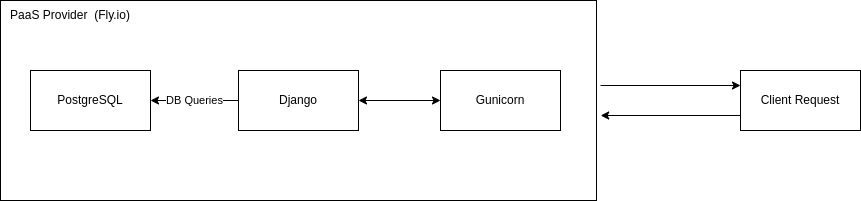
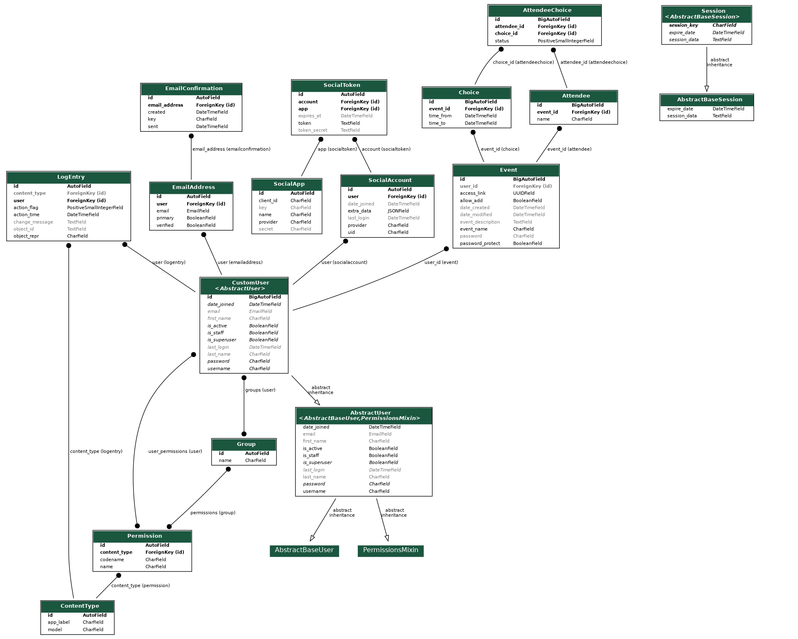
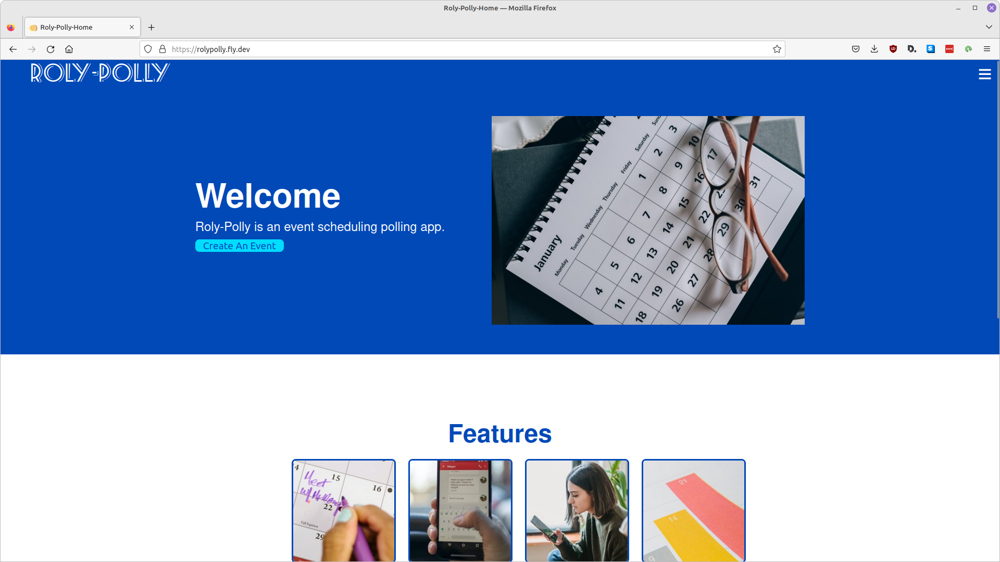
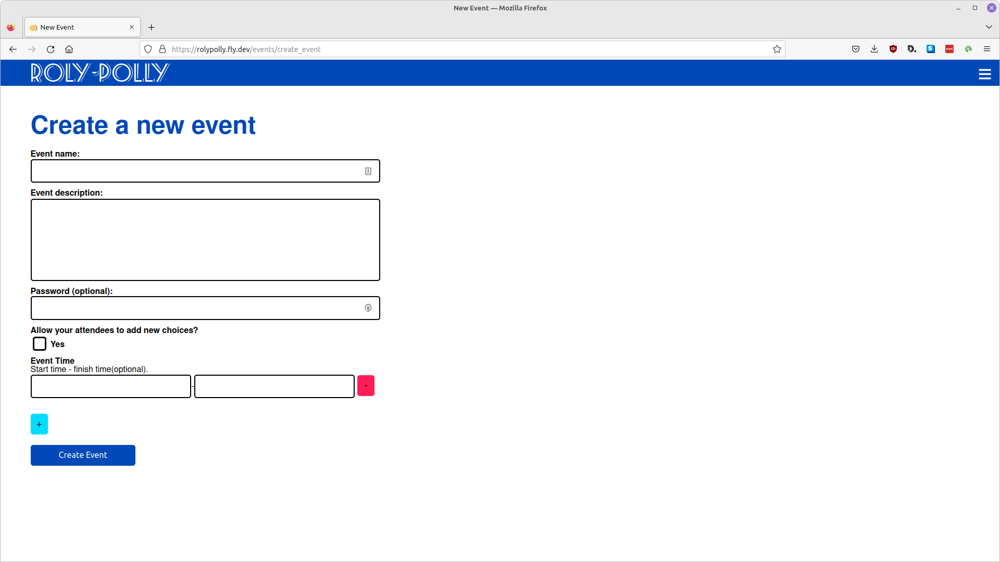
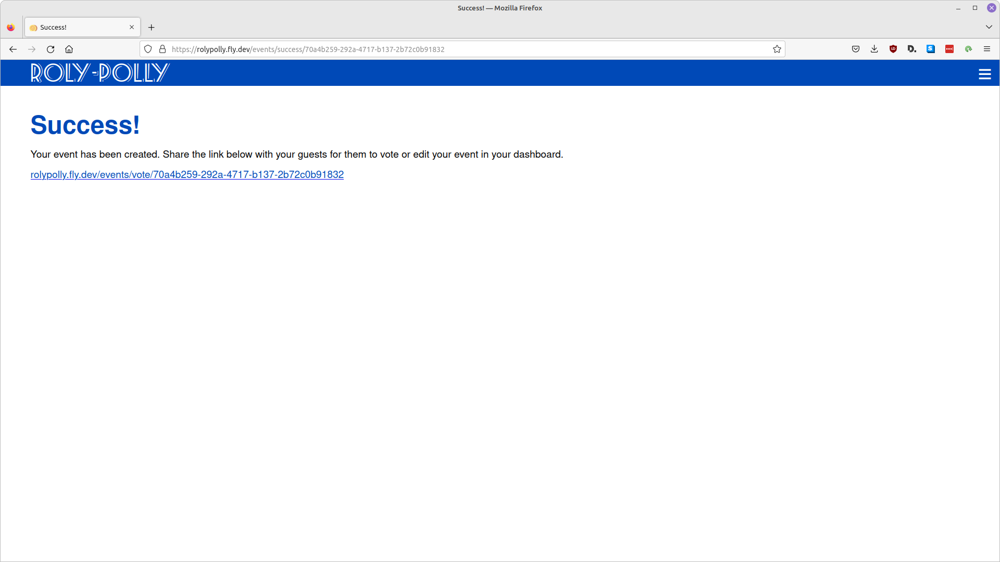
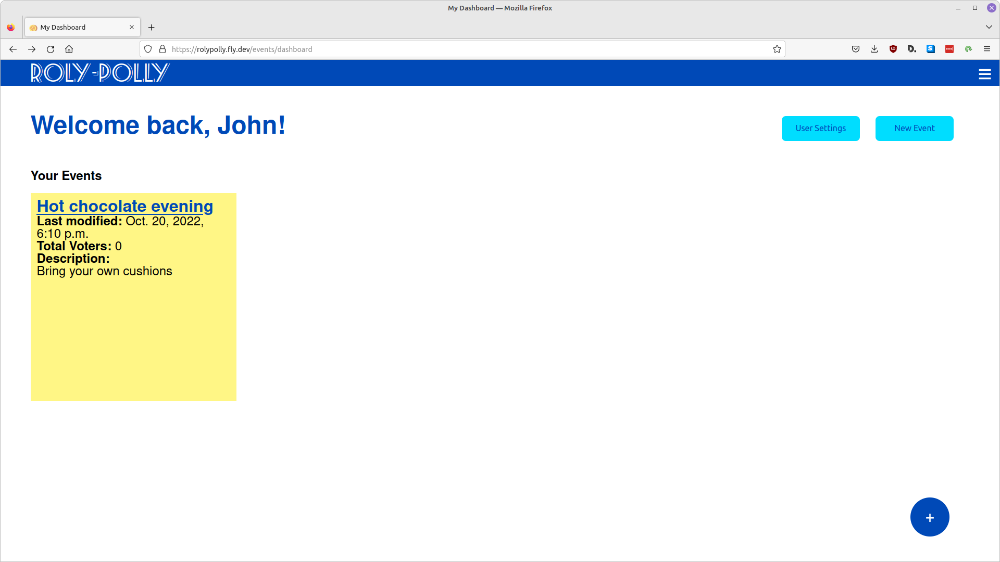
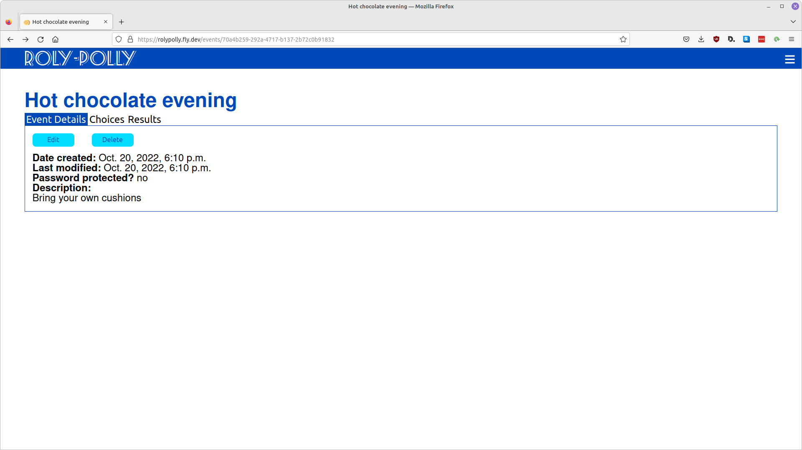

# Event Scheduling App (Roly-Polly)
[Live Demo](https://rolypolly.fly.dev)

## Table of Contents

1. [About](#about)
2. [Deployment Architecture](#deployment-architecture)
3. [Database Schema](#database-schema)
4. [Technologies Used](#technologies-used)
5. [Gallery](#gallery)

## About

This project is a full stack event scheduling polling application. It features an authentication system which allows users to manage and edit their events. Event creators can also create events anonymously if they do not wish to create an account. Each event created generates a shareable voting link which can optionally be password protected.

### Django

This project uses Django for both the front end and the back end.

### Shareable Password Protected Links

Each event generates a shareable voting link. UUIDs are used in the URL to identify each event to prevent users from finding events by sequentially testing integers. Polls can optionally be password protection. The password protection function has been implemented with sessions to allow anonymous users to log into specific pages

### Asynchronous Emails

The first implementation of this application used Celery to send emails asynchronously with Redis as the broker. The deployed application on Fly uses Python’s built-in threading module instead of Celery. Task scheduling is not used. Using the threading module instead of Celery allows for a simpler deployment without the need to define other services.

## Deployment Architecture

This application is deployed on Fly.io as a Docker container.

## Database Schema

AttendeeChoice represents a many-to-many relation. It has been implemented with foreign keys to allow the “status” field to be added. Each voter can vote for multiple choices and each choice has multiple voters.

## Technologies Used
- Django
- PostgreSQL

## Gallery

